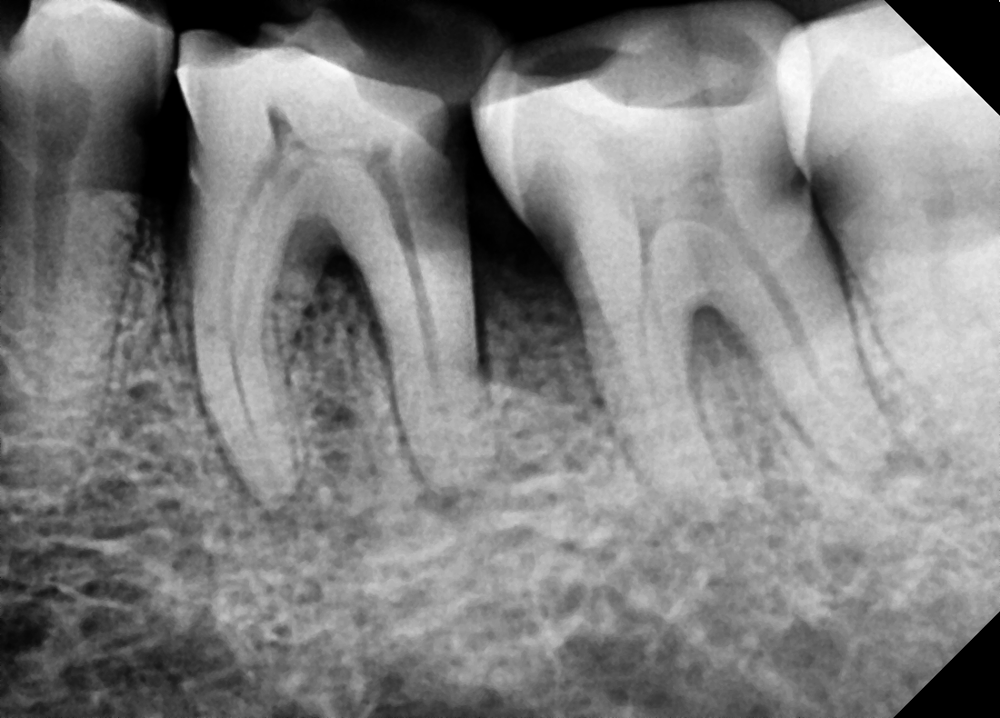
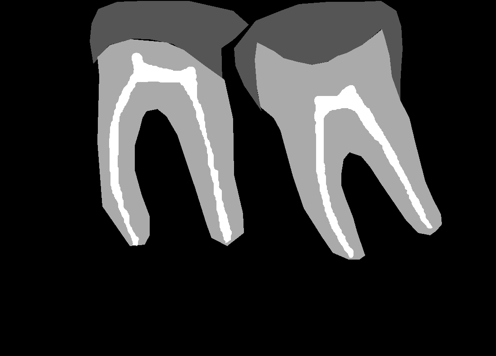

# Radiovisiographic Image Segmentation using Attention U-net and Attention U-net++ Architecture.

This entire folder is a collection of a lot of research and trials to perform image segmentation between the three segments of the tooth, namely - Enamel, Dentine and Pulp, while fourth segment is simply the background.

## 1. Data 
The data used to train the model in this trial is a set of image-mask pairs. The images graciously provided by Oralvis Healthcare Pvt Ltd are annotated by me into the three major classes under the guidance of my mentors.

The images look something like this. 



While the corresponding mask would like something like this. 



As clear as it is, only very clear and well defined tooth have been labelled.

There are 2 types of labels used here. The Enamels and Dentines are labelled in a polygon format which is basically a set of (x, y) pairs while the Pulp is stored in a brush label format which is RLE Encoded.

## 2. Data conversion

The data was exported in a brush label to COCO format. This particular format helped by exported the polygon labels as a set of ```(x, y)``` pairs and the brush labels as RLE Encoded without leaving off any of the classes accidentally.

While slightly tiresome, the image names and mask names have a slight difference between them. The masks have a prefix added by Label Studio which needs to be first matched and then only the pair can be decoded. The RLE Encoded Pulp masks are decoded using the ```pycocotools.masks``` module.

The Dentine mask was completely overlapping the Pulp mask which needed some bitwise ```AND``` operation logic but eventually, I was able to subtract the Pulp from the Dentine to create a mask with 4 classes - ```Backround - 0, Enamel - 1, Dentine - 2, Pulp - 3```. These were also the values used in the pixelwise class annotations as well. They were multiplied by ```85``` to make an easily readable version as well.

It was saved in the below file format.
```
data
├── images
│   ├── RVG_1.png
│   ├── RVG_2.png
│   ├── RVG_3.png
│   └── ...
│
└── masks
    ├── RVG_1_mask.png
    ├── RVG_2_mask.png
    ├── RVG_3_mask.png
    └── ...
```
## 3. Data loading in models. 

The data which is a set of image-mask pairs is loaded as a pair into a ```tensorflow.data.Dataset``` object without changing the dimensions of the image to preserve as much information as possible which means the size of the image as well as the mask is ```(790, 1100, 1)``` and I intend to change this in the future. I've taken a ```80:10:20``` split for the train, validation and tests sets with a ```batch_size``` of 4. 

## 4. Attention U-net and Attention U-net++ Architecture.

The Attention U-net model is created in blocks for readability and debugging. There are 4 blocks in particular. 

#### 1. Convolution block 
```
def conv_block(x, num_filters):

    x = L.Conv2D(num_filters, kernel_size = (3, 3), padding="same")(x)
    x = L.BatchNormalization()(x)
    x = L.Activation("relu")(x)

    x = L.Conv2D(num_filters, kernel_size = (3, 3), padding="same")(x)
    x = L.BatchNormalization()(x)
    x = L.Activation("relu")(x)

    return x
```

It is a simple 2 layer convolution pattern. It downsamples the image.

#### 2. Encoder block

```
def encoder_block(x, num_filters):
    x = conv_block(x, num_filters)
    p = L.MaxPool2D((2, 2), padding="same")(x)
    return x, p
```

#### 3. Attention Gate 

```
def attention_gate(g, s, num_filters):

    wg = L.Conv2D(num_filters, 1, padding="same")(g)
    wg = L.BatchNormalization()(wg)

    ws = L.Conv2D(num_filters, 1, padding="same")(s)
    ws = L.BatchNormalization()(ws)

    out = L.Activation("relu")(wg + ws)
    out = L.Conv2D(num_filters, 1, padding="same")(out)
    out = L.Activation("sigmoid")(out)

    return out * ws
```

This is a standard self-attention gate created for a convolutional neural network. This helps the model understand where to focus when calculating the class of each pixel. 

#### 4. Decoder block 
```
def decoder_block(x, s, num_filters):
    x_up = L.UpSampling2D((2,2), interpolation="nearest")(x)
    
    s_att = attention_gate(x_up, s, num_filters)

    x = L.Concatenate()([x_up, s_att])
    x = conv_block(x, num_filters)
    return x
```

This is the decoder side of the Attention U-net and it upsamples the feature map. 


### The actual architecture of the Attention U-net

The model follows the standard U-net architecture described in [GeeksForGeeks](https://www.geeksforgeeks.org/machine-learning/u-net-architecture-explained/) but with the addition of attention gates in the decoder blocks as defined above. The real model uses an initial filter count of 128 which scales up to 2048. However, I've used an initial count of 16 filters which scales up to 512 filters to save space as there is no dampening of the image dimensions as well.

### The actual architecture of the Attention U-net++

The architecture of the Attention U-net++ is a little more complicated that I expected. It involved me removing almost the entirety of the code blocks as it was too many paths and states to track eventually. 


As we can see, the architecture of the standard U-net++ is as given above.

It contains dense skip connections along with deep supervision for best results.

## 5. Training the models 

The model training is quite standard for both the architectures. However, with deep supervision enabled, we need to transform the target shape a little to match the output style of all 4 heads of the U-net. Each model was trained for ```200 epochs``` with ```tf.keras.callbacks.ReduceLROnPlateau``` and ```tf.keras.callbacks.EarlyStopping``` as callbacks.

## 6. Results

#### 1. Attention U-net 


As we can see, the result is pretty bad and not aesthetically pleasing. 

#### 2. Attention U-net++


As we can see, the results are pretty good while using an Attention U-net++ with deep supervision emabled.

The loss curves for the above are also following the typical trend.


## 7. Conclusion

I aim to improve these results further by trying various sorts of U-net architectures along with different types of attentions as well.